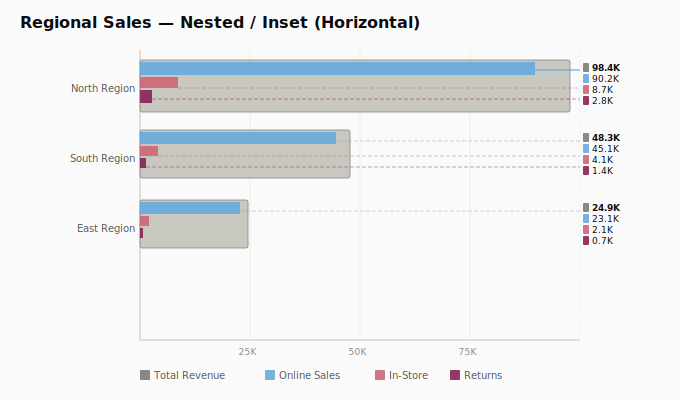
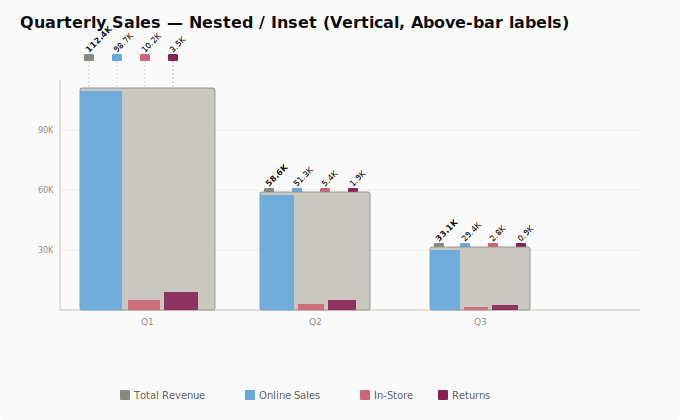
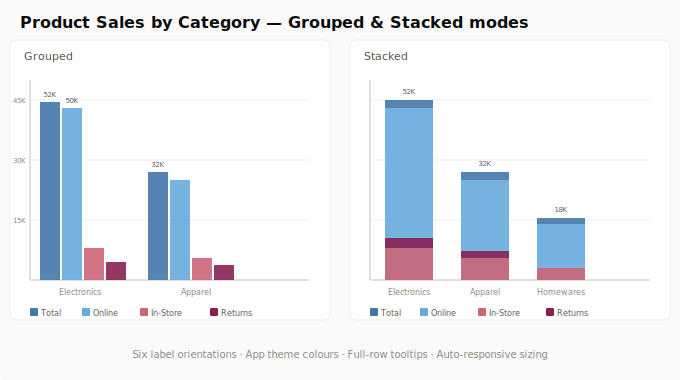

# FlexBarChart — Qlik Sense Extension

**v2.5** · Grouped · Stacked · Nested / Inset · Horizontal & Vertical

A feature-rich bar chart extension for Qlik Sense that goes beyond the native bar chart with nested/inset bar support, fixed-top label swatches, colour-matched connector lines, and a clean property panel that follows native Qlik UX patterns.

---

## Screenshots

### Nested / Inset — Horizontal

### Nested / Inset — Vertical (Above-bar labels)

### Grouped & Stacked modes

---

## Features

### Chart Modes
| Mode | Description |
|------|-------------|
| **Grouped** | Side-by-side bars per category |
| **Stacked** | Segmented bars for part-to-whole comparison |
| **Nested / Inset** | Child measure bars displayed inside a consolidated parent bar |

All modes support both **Horizontal** and **Vertical** bar direction.

### Nested / Inset Design
- **Parent bar** — neutral gray to distinguish the total envelope from individual measures
- **Child bars** — palette colours, clipped inside the parent bar boundary
- **Horizontal** — right-side label column with colour-matched connector lines from each bar tip
- **Vertical** — fixed-top swatch band (consistent y-position for all columns), dashed lines drop to bar tips

### Label Orientations
- `Horizontal` — value text at bar tip
- `Vertical` — rotated inside bar
- `Tilted 45°` — at bar tip
- `Above bar: Tilted 45°` — nested vertical: tilted values above swatch band
- `Above bar: Vertical 90°` — nested vertical: upright values above swatch band
- `Auto` — automatic collision detection with stagger offsets

### Color System
- **Inherit from app theme** (default) — reads the app's applied theme palette automatically
- **Set colors manually** — coloring mode (by measure / by dimension / single), 6 palette presets, custom hex CSV, per-measure hex overrides
- Legend swatch for Consolidated automatically uses gray to match the bar

### Responsiveness
- Bars always fill the available container — no manual size sliders
- Minimum bar size = 10px; chart scrolls automatically below that threshold

### Other Features
- Full-row tooltip on bar hover AND dimension axis label hover
- Legend: Bottom / Top / Left / Right / Hidden
- Sorting: load order, dimension A→Z/Z→A, measure ascending/descending
- Axis label controls: show/hide, angle, full/truncated labels

---

## Installation

1. Download **[FlexBarChart_v2.5.zip](https://github.com/sheikhasadullahmahrab/flexbarchart/raw/main/FlexBarChart_v2.5.zip)**
2. In Qlik Sense QMC or Dev Hub → **Extensions** → **Import**
3. Upload the zip — FlexBarChart appears in the chart library

**Compatibility:** Qlik Sense May 2025 Patch 15 (QSEoW 14.231.27+) · Qlik Sense SaaS

---

## Quick Start — Nested / Inset

1. Add FlexBarChart to a sheet
2. Add 1 dimension (e.g. Airport name)
3. Add 2–5 measures (e.g. Total Passengers, Flights, Cargo)
4. Appearance → Presentation → Chart mode: `Nested / Inset`
5. Set **Consolidated / parent measure** to your total/envelope measure
6. Appearance → Data points → Value label style: `Above bar: Tilted 45°`

---

## Property Panel

| Section | Settings |
|---------|----------|
| General | Show titles, Title |
| Presentation | Chart mode, Bar direction, Consolidated measure, Grid lines |
| Data points | Show values, Value label style |
| Colors | Theme inherit / Manual: coloring mode, palette, per-measure hex |
| Legend | Position |
| X-axis | Labels, Angle, Title |
| Y-axis | Labels, Label width, Title |
| Tooltip | Show on hover |

---

## Changelog

| Version | Changes |
|---------|---------|
| **v2.5** | Property panel overhaul (flat + text separators). Colors: switch→dropdown. Colorpicker→hex string inputs. Unique label names. nestedParentKey in Presentation. |
| **v2.1** | Margins tightened. Connector lines clamped at baseline. Legend swatch consistency. Per-measure hex overrides. |
| **v2.0** | Stable baseline. |
| **v1.9** | Auto-responsive 10px floor. Colour-matched connector lines. No size sliders. |
| **v1.8** | Fixed-top swatch band. tilted45/vertical90 modes. Gray parent bar. |
| **v1.1–v1.7** | D3 v7. All 3 chart modes. Label collision detection. Theme colors. Full-row tooltips. |

---

## License

MIT — free to use, modify and distribute.

*[Report an issue](https://github.com/sheikhasadullahmahrab/flexbarchart/issues)*
